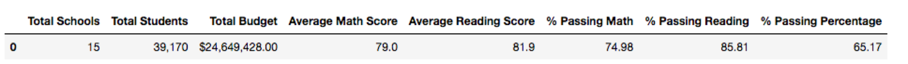
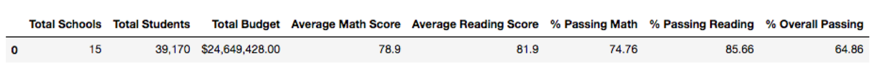
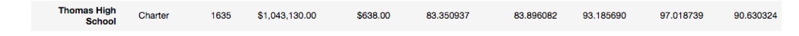
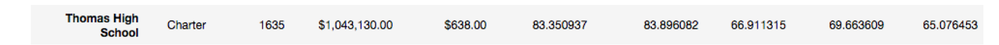

# School District Analysis

## Overview of the School District Analysis

The school district analysis consists of preparing standardized test data from a variety of sources and formats for analysis, reporting and presentation to provide insights about performance trends and patterns. The insights are used to inform discussions at the school and district level and assist the school board reagarding school budget and priority. 

The objectives of the original analysis was to analyze data on student funding and students standardized test scores, aggregate the data and showcase trends and school performance.

However, the school board has notified that the students_complete.csv file shows evidence of academic dishonesty; specifically, reading and math grades for Thomas High School ninth graders appear to have been altered. Although the school board does not know the full extent of the academic dishonesty, they want to uphold state-testing standards. 

Based on this notice, the objective of the following analysis is to replace the math and reading scores for Thomas High School with NaNs while keeping the rest of the data intact. Once the math and reading scores have been replaced. It is expected to repeat the school district analysis that has been initially done and describe how these changes affected the overall analysis. 

---
## School District Analysis Results

The impact of replacing the math and reading scores for Thomas High School with NaNs can be summarize as follows:

### - District Summary Impact

  Comparing the original and updated analysis, it can be seen that there's a neglectable (less than 1%) impact when removing 461 test scores from the    total 39170 student data set.  

  Original Analysis 

  Updated Analysis

	
### - School Summary Impact

  The impact of removing the 9th grader scores from the Thomas High School data set is pretty significant with a drop in the overall passing of 25% (from 91% to 65%).
  
  Original Analysis 

  Updated Analysis

### - Thomas High School Performance with respect to other schools

### - Math and Reading Scores by Grade Impact

### - Scores by School Spending Impact

### - Scores by School Size Impact

### - Scores by School Type Impact
 

---
## School District Analysis Summary

* One way to use this script for any other election would be to modify the script to be able to use a generic csv name as oppose to a given specific name.

---
